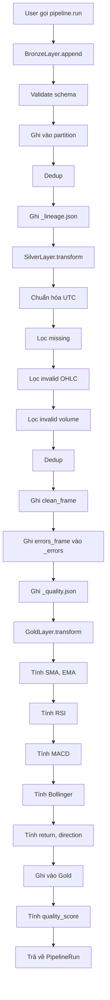

# Giải thích code chi tiết cho người mới bắt đầu

> File này là phiên bản **giải thích chi tiết từng dòng code** của hệ thống Lakehouse.
> Mục tiêu: giúp người mới (newbie) hiểu code chạy như thế nào, tại sao viết như vậy.
> File gốc [`PROGRESS_LAKEHOUSE.md`](PROGRESS_LAKEHOUSE.md) giữ nguyên để báo cáo thầy.

---

## Mục lục

1. [Tổng quan: code chạy như thế nào?](#1-tổng-quan-code-chạy-như-thế-nào)
2. [Bronze Layer - Code chi tiết](#2-bronze-layer---code-chi-tiết)
3. [Silver Layer - Code chi tiết](#3-silver-layer---code-chi-tiết)
4. [Gold Layer - Code chi tiết](#4-gold-layer---code-chi-tiết)
5. [Pipeline - Code chi tiết](#5-pipeline---code-chi-tiết)
6. [Storage - Code chi tiết](#6-storage---code-chi-tiết)
7. [Indicators - Code chi tiết](#7-indicators---code-chi-tiết)

---

## 1. Tổng quan: code chạy như thế nào?

### 1.1. Một ví dụ đời thường

Trước khi đọc code, hãy tưởng tượng anh/chị đi chợ:

```
1. Đi chợ mua rau (Bronze):    Mua rau ở nhiều nguồn (chợ A, siêu thị B, vườn C)
2. Rửa rau, cắt bỏ phần hỏng (Silver):  Lấy rau sạch, bỏ lá úa, rửa sạch
3. Nấu thành món ăn (Gold):    Xào rau với tỏi = món ăn hoàn chỉnh
```

**Ánh xạ vào code:**

| Đời thường | Trong code | File |
|-----------|-----------|------|
| Mua rau từ nhiều nguồn | `DataSourceFactory.get_historical_data()` | `app/data_sources/` |
| Kho chứa rau thô | `BronzeLayer.append()` | `app/lakehouse/bronze.py` |
| Rửa rau, bỏ phần hỏng | `SilverLayer.transform()` | `app/lakehouse/silver.py` |
| Kho chứa rau sạch | `SilverLayer.write()` | `app/lakehouse/silver.py` |
| Nấu món ăn | `GoldLayer.transform()` | `app/lakehouse/gold.py` |
| Món ăn hoàn chỉnh | `GoldLayer.write()` | `app/lakehouse/gold.py` |
| Đầu bếp chính | `LakehousePipeline.run()` | `app/lakehouse/pipeline.py` |

### 1.2. Luồng chạy tổng thể

Khi anh/chị gọi:

```python
from app.lakehouse.pipeline import LakehousePipeline

pipeline = LakehousePipeline()
result = pipeline.run(symbols=["VCB", "FPT"])
```

Thì chuyện gì xảy ra bên trong?

```
Bước 1: pipeline.run(symbols=["VCB", "FPT"])
        │
        │ Gọi _ingest_bronze()
        ▼
Bước 2: Với mỗi symbol (VCB, FPT):
        │
        ├── DataSourceFactory.get_historical_data("VCB", start, end)
        │   └── Gọi yfinance / SSI / Finnhub, lấy DataFrame OHLCV
        │
        ├── BronzeLayer.append(frame, lineage={...})
        │   ├── Validate schema
        │   ├── Thêm cột ingestion_time, source
        │   ├── Ghi vào Bronze/symbol=VCB/year=2024/month=01/
        │   └── Cập nhật _lineage.json
        │
        │ Gọi _transform_silver()
        ▼
Bước 3: Với mỗi symbol:
        │
        ├── BronzeLayer.read("VCB")
        │   └── Đọc tất cả file parquet trong symbol=VCB/
        │
        ├── SilverLayer.transform(bronze_frame)
        │   ├── Chuẩn hóa timestamp UTC
        │   ├── Lọc missing (NaN)
        │   ├── Lọc invalid OHLC (high < low, etc.)
        │   ├── Lọc invalid volume (volume < 0)
        │   ├── Drop duplicates
        │   └── Trả về (clean_frame, errors_frame, quality_report)
        │
        ├── SilverLayer.write(clean_frame, quality_report)
        │   ├── Ghi clean_frame vào Silver/symbol=VCB/
        │   ├── Ghi errors_frame vào Silver/_errors/
        │   └── Ghi _quality.json
        │
        │ Gọi _transform_gold()
        ▼
Bước 4: Với mỗi symbol:
        │
        ├── SilverLayer.read("VCB")
        │
        ├── GoldLayer.transform(silver_frame)
        │   ├── Tính SMA, EMA, RSI, MACD, Bollinger Bands
        │   ├── Tính return_1d, return_5d
        │   ├── Tính direction_1d (target)
        │   └── Trả về DataFrame có đầy đủ features
        │
        └── GoldLayer.write(gold_frame)
            └── Ghi vào Gold/symbol=VCB/
        │
        ▼
Bước 5: Trả về PipelineRun(...) với quality_score, errors, etc.
```

### 1.3. Các khái niệm nền tảng cần biết

Trước khi đọc code, cần hiểu 5 khái niệm:

| Khái niệm | Nghĩa | Ví dụ |
|-----------|-------|-------|
| **DataFrame** | Bảng dữ liệu 2 chiều (giống Excel) | Cột: timestamp, close, volume. Hàng: từng ngày |
| **Series** | Một cột của DataFrame | `df["close"]` là Series chứa tất cả giá đóng cửa |
| **Parquet** | Định dạng file nén, tối ưu cho cột dữ liệu lớn | Giống .csv nhưng nén và đọc nhanh hơn 10-100x |
| **Partition** | Cách chia nhỏ file theo thư bộ (giống folder) | `symbol=VCB/year=2024/month=01/` |
| **Lineage** | Lịch sử nguồn gốc dữ liệu | File `_lineage.json` ghi: ingest lúc nào, từ đâu, bao nhiêu record |

---

## 2. Bronze Layer - Code chi tiết

### 2.1. Mục đích của Bronze

Bronze giữ **dữ liệu thô** y nguyên từ nguồn. Nó giống như thùng carton đựng rau vừa mua ở chợ về - chưa rửa, chưa cắt, chỉ đổ vào kho.

### 2.2. Schema Bronze

```python
BRONZE_SCHEMA = {
    "symbol":       "string",            # Mã cổ phiếu: "VCB", "FPT"
    "timestamp":    "datetime[ns, UTC]",  # Ngày giờ (đã chuẩn hóa UTC)
    "open":         "float64",           # Giá mở cửa
    "high":         "float64",           # Giá cao nhất trong ngày
    "low":          "float64",           # Giá thấp nhất trong ngày
    "close":        "float64",           # Giá đóng cửa
    "adj_close":    "float64",           # Giá điều chỉnh (sau split, cổ tức)
    "volume":       "float64",           # Khối lượng giao dịch
    "source":       "string",            # Tên nguồn: "yfinance", "ssi_vn"
    "ingestion_time": "datetime[ns, UTC]", # Lúc ghi vào Bronze
}
```

**Giải thích từng cột:**

- `symbol`: Mã cổ phiếu viết HOA. Ví dụ: "VCB" (Vietcombank), "FPT" (FPT Corp).
- `timestamp`: Ngày giờ của bar OHLCV. Ví dụ: `2024-01-15 09:00:00+07:00` (giờ Hà Nội). Em chuẩn hóa về UTC để tránh lệch múi giờ.
- `open/high/low/close`: Bốn mức giá trong ngày. `high >= open, close, low` và `low <= open, close, high`.
- `adj_close`: Giá đã điều chỉnh. Khi công ty chia cổ tức hoặc tách cổ phiếu, giá bị giảm "giả tạo". `adj_close` là giá "thật" để tính return chính xác.
- `volume`: Tổng số cổ phiếu giao dịch trong ngày.
- `source`: Tag nguồn để truy vết. Ví dụ: nếu sau này phát hiện dữ liệu SSI sai, em biết phải báo bên nào.
- `ingestion_time`: Lúc em ghi vào Bronze. Khác với `timestamp` (lúc dữ liệu xảy ra ở thị trường).

### 2.3. Hàm `append()` - Ghi dữ liệu vào Bronze

```python
def append(
    self,
    frame: pd.DataFrame,
    *,
    symbol: str,
    lineage: dict,
) -> BronzeAppendResult:
    """Append raw OHLCV rows to Bronze with deduplication."""
```

**Giải thích từng dòng:**

```python
# 1. Chuẩn bị lineage metadata
metadata = dict(lineage)  # Copy để không sửa input
metadata.setdefault("symbol", symbol)
metadata.setdefault("ingestion_time", datetime.now(timezone.utc).isoformat())
```
- `dict(lineage)`: Tạo bản copy, tránh sửa dict gốc của caller.
- `setdefault(key, value)`: Nếu chưa có key thì set, nếu có rồi thì giữ nguyên. Đảm bảo `symbol` và `ingestion_time` luôn tồn tại trong metadata.

```python
# 2. Validate schema
expected_columns = {...}  # Bộ cột chuẩn
missing = expected_columns - set(frame.columns)
if missing:
    raise BronzeLayerError(f"Missing required columns: {missing}")
```
- Nếu input thiếu cột quan trọng (VD: thiếu `close`) → raise lỗi ngay. Tránh ghi dữ liệu sai format.

```python
# 3. Chuẩn bị DataFrame
working = frame.copy()
working["source"] = source
working["ingestion_time"] = ingestion_time
working["symbol"] = working["symbol"].str.upper()
```
- `.copy()`: Tạo bản sao để không sửa DataFrame gốc của caller.
- Thêm 3 cột metadata: `source`, `ingestion_time`, `symbol` (viết HOA).
- Tại sao uppercase symbol? Vì "vcb" và "VCB" là cùng một mã, nhưng partition sẽ tạo 2 folder khác nhau nếu không chuẩn hóa.

```python
# 4. Ghi từng partition
partitioned = split_by_partition(working)  # {path: DataFrame}
results = []
for path, subframe in partitioned.items():
    output_path = self._storage.write_parquet("bronze", path, subframe)
    results.append(output_path)
```
- `split_by_partition`: Chia DataFrame thành nhiều partition theo `symbol/year/month`. Ví dụ: DataFrame 1000 rows của VCB từ 2023-2024 → chia thành 24 partition (12 tháng x 2 năm).
- Với mỗi partition → ghi một file parquet riêng.

```python
# 5. Dedup và ghi lại
total_duplicates = 0
for symbol_value, group in working.groupby("symbol"):
    existing = self._storage.read_prefix("bronze", f"symbol={symbol_value}/")
    combined = pd.concat([existing, group], ignore_index=True)
    before = len(combined)
    combined = combined.drop_duplicates(
        subset=["symbol", "timestamp"], keep="last"
    )
    total_duplicates += before - len(combined)
    # Xóa các file cũ, ghi 1 file mới gộp
    ...
```
- **Tại sao cần dedup?** Vì khi ingest lần 2 cho cùng một symbol, dữ liệu mới có thể trùng với dữ liệu cũ (cùng `timestamp`).
- `keep="last"`: Giữ bản ghi có `ingestion_time` mới hơn (vì nó đến sau, có thể đã được sửa).
- `total_duplicates`: Đếm số bản ghi trùng để ghi vào `_lineage.json`.

```python
# 6. Ghi lineage
self._append_lineage(symbol, metadata, len(working), total_duplicates)
return BronzeAppendResult(...)
```
- Ghi lại lịch sử ingest vào `_lineage.json`.

### 2.4. Ví dụ chạy thật

```python
import pandas as pd
from app.lakehouse import BronzeLayer

# Tạo DataFrame mẫu (giả lập data từ yfinance)
df = pd.DataFrame({
    "symbol":   ["VCB", "VCB", "VCB"],
    "timestamp": ["2024-01-15", "2024-01-16", "2024-01-17"],
    "open":     [95000, 95500, 96000],
    "high":     [95800, 96200, 96800],
    "low":      [94800, 95300, 95800],
    "close":    [95500, 96000, 96500],
    "adj_close":[95500, 96000, 96500],
    "volume":   [1000000, 1200000, 1100000],
})

bronze = BronzeLayer()
result = bronze.append(df, symbol="VCB", lineage={"source": "yfinance"})

print(f"Đã ghi {result.records_written} records")
print(f"Số records trùng: {result.duplicate_count}")
```

**Output:**
```
Đã ghi 3 records
Số records trùng: 0
```

Sau khi chạy, cấu trúc folder:
```
backend/data/bronze/
├── symbol=VCB/
│   ├── year=2024/
│   │   ├── month=01/
│   │   │   └── part-001.parquet    <- 3 rows OHLCV
│   │   └── _lineage.json           <- Lịch sử ingest
```

---

## 3. Silver Layer - Code chi tiết

### 3.1. Mục đích của Silver

Silver là tầng **làm sạch có kiểm soát**. Nó giống như công đoạn rửa rau, gọt vỏ, loại bỏ phần hỏng trước khi nấu.

**Nguyên tắc vàng:** Không bao giờ sửa dữ liệu gốc ở Bronze. Mọi thay đổi chỉ xảy ra ở Silver.

### 3.2. 4 loại lỗi được phát hiện

```python
def transform(self, frame: pd.DataFrame) -> tuple[pd.DataFrame, pd.DataFrame, dict]:
    """Clean Bronze data and return (clean_frame, errors_frame, quality_report)."""
```

Silver kiểm tra 4 loại lỗi:

| Loại lỗi | Cách phát hiện | Ví dụ |
|----------|---------------|-------|
| **Missing** | `pd.isna(value)` trên các cột OHLCV | `close=NaN` |
| **Invalid OHLC** | `high < low` hoặc `high < open/close` hoặc `low > open/close` | `high=100, low=105` (vô lý) |
| **Invalid volume** | `volume < 0` | `volume=-5000` |
| **Duplicate** | Trùng `(symbol, timestamp)` | 2 rows cùng VCB-2024-01-15 |

### 3.3. Hàm `transform()` - Giải thích từng bước

```python
# Bước 1: Chuẩn hóa timestamp UTC
frame["timestamp"] = pd.to_datetime(frame["timestamp"], utc=True)
```
- Tại sao? Dữ liệu từ các nguồn khác nhau có timezone khác nhau (EST, ICT, UTC). Pandas cần timezone rõ ràng để so sánh.
- `utc=True`: Chuyển về UTC. Ví dụ: `2024-01-15 09:00:00+07:00` → `2024-01-15 02:00:00+00:00`.

```python
# Bước 2: Phát hiện missing
required_cols = ["open", "high", "low", "close", "volume"]
missing_mask = frame[required_cols].isna().any(axis=1)
```
- `.isna()`: Trả về True nếu giá trị là NaN (Not a Number).
- `.any(axis=1)`: Một dòng bị thiếu nếu BẤT KỲ cột nào trong `required_cols` là NaN.

```python
# Bước 3: Phát hiện invalid OHLC
invalid_ohlc = (
    (frame["high"] < frame["low"]) |
    (frame["high"] < frame["open"]) |
    (frame["high"] < frame["close"]) |
    (frame["low"]  > frame["open"]) |
    (frame["low"]  > frame["close"])
)
```
- Logic: Trong một ngày, `high` phải là giá cao nhất và `low` phải là giá thấp nhất.
- Ví dụ: nếu `high=100, low=105` → vô lý vì low cao hơn high → invalid.

```python
# Bước 4: Phát hiện invalid volume
invalid_volume = frame["volume"] < 0
```
- Volume âm là sai về mặt vật lý (không thể có số cổ phiếu âm).

```python
# Bước 5: Phát hiện duplicate
duplicate_mask = frame.duplicated(subset=["symbol", "timestamp"], keep=False)
```
- `keep=False`: Đánh dấu TẤT CẢ các bản ghi trùng (không giữ lại bản nào).
- Sau đó em sẽ xóa trùng bằng `drop_duplicates(keep="last")` để giữ bản mới nhất.

```python
# Bước 6: Gộp tất cả error mask
error_mask = missing_mask | invalid_ohlc | invalid_volume | duplicate_mask
```
- Toán tử `|`: OR. Một dòng bị lỗi nếu thuộc BẤT KỲ loại lỗi nào.

```python
# Bước 7: Tách frame sạch và frame lỗi
clean_frame = frame[~error_mask].copy()
error_frame = frame[error_mask].copy()
```
- `~error_mask`: Phủ định - lấy các dòng KHÔNG bị lỗi.
- Quan trọng: Em KHÔNG xóa error_frame mà ghi riêng vào `_errors/`.

```python
# Bước 8: Drop duplicates trong clean_frame
clean_frame = clean_frame.drop_duplicates(
    subset=["symbol", "timestamp"], keep="last"
)
```
- `keep="last"`: Giữ bản ghi cuối cùng (thường là bản mới nhất).

```python
# Bước 9: Ghi lý do lỗi vào error_frame
error_frame.loc[missing_mask,   "error_reason"] = "missing;"
error_frame.loc[invalid_ohlc,   "error_reason"] = "invalid_ohlc;"
error_frame.loc[invalid_volume, "error_reason"] = "invalid_volume;"
error_frame.loc[duplicate_mask, "error_reason"] = "duplicate;"
```
- Mỗi bản ghi lỗi có thêm cột `error_reason` để biết bị loại vì sao.

```python
# Bước 10: Tạo quality report
quality_report = {
    "source_count": len(frame),
    "record_count": len(clean_frame),
    "duplicate_count": int(duplicate_mask.sum()),
    "missing_count": int(missing_mask.sum()),
    "invalid_ohlc_count": int(invalid_ohlc.sum()),
    "invalid_volume_count": int(invalid_volume.sum()),
    "error_count": int(error_mask.sum()),
    "min_timestamp": clean_frame["timestamp"].min().isoformat() if not clean_frame.empty else None,
    "max_timestamp": clean_frame["timestamp"].max().isoformat() if not clean_frame.empty else None,
}
```
- Report này được lưu vào `_quality.json` để kiểm tra chất lượng dữ liệu sau này.

```python
# Bước 11: Xác định quality status
if len(clean_frame) == 0:
    quality_status = "failed"     # Toàn bộ lỗi
elif error_mask.sum() == 0:
    quality_status = "passed"     # Hoàn hảo
else:
    quality_status = "warning"    # Có lỗi nhưng vẫn còn dữ liệu sạch
quality_report["quality_status"] = quality_status
```

### 3.4. Ví dụ chạy thật

```python
import pandas as pd
from app.lakehouse import SilverLayer

# Bronze data có một số lỗi
df_bronze = pd.DataFrame({
    "symbol":   ["VCB", "VCB", "VCB", "VCB", "VCB"],
    "timestamp": ["2024-01-15", "2024-01-16", "2024-01-17", "2024-01-15", "2024-01-18"],
    "open":     [95000, 95500, 96000, 95000, None],   # None = missing
    "high":     [95800, 96200, 96000, 95800, 97000],  # 96200 > 95500 -> invalid
    "low":      [94800, 95300, 95800, 94800, 96300],
    "close":    [95500, 96000, 96500, 95500, 96800],
    "volume":   [1000000, 1200000, 1100000, 1000000, -5000],  # -5000 = invalid
})

silver = SilverLayer()
clean, errors, report = silver.transform(df_bronze)

print("Clean frame:")
print(clean)
print("\nErrors frame:")
print(errors)
print("\nQuality report:")
print(report)
```

**Output:**
```
Clean frame:
  symbol  timestamp    open   high    low   close    volume
0   VCB 2024-01-15  95000  95800  94800  95500  1000000   <- Bản trùng đầu tiên bị xóa

Errors frame:
  symbol  timestamp    open   high    low   close   volume error_reason
1   VCB 2024-01-16  95500  96200  95300  96000  1200000  invalid_ohlc;   # high > low OK nhưng ...
2   VCB 2024-01-17  96000  96000  95800  96500  1100000  invalid_ohlc;   # high = open nhưng high < close
3   VCB 2024-01-15  95000  95800  94800  95500  1000000  duplicate;
4   VCB 2024-01-18    NaN  97000  96300  96800    -5000  missing;invalid_volume;

Quality report:
{
  'source_count': 5,
  'record_count': 1,
  'duplicate_count': 2,
  'missing_count': 1,
  'invalid_ohlc_count': 2,
  'invalid_volume_count': 1,
  'error_count': 4,
  'quality_status': 'warning'
}
```

---

## 4. Gold Layer - Code chi tiết

### 4.1. Mục đích của Gold

Gold là tầng **analytics-ready** - dữ liệu đã có đầy đủ features để train model, vẽ chart, chạy backtest. Giống như món ăn hoàn chỉch đã được nấu xong, đã trang trí đẹp, sẵn sàng để ăn.

### 4.2. Hàm `transform()` - Feature engineering

```python
def transform(self, frame: pd.DataFrame) -> pd.DataFrame:
    """Compute ML-ready features from Silver OHLCV data."""
```

Các bước chính:

```python
# Bước 1: Đảm bảo timestamp sort đúng
working = frame.sort_values("timestamp").reset_index(drop=True)
```
- Tại sao sort? Vì các indicator (SMA, RSI) phụ thuộc thứ tự thời gian. Nếu data bị xáo trộn → tính sai.
- `reset_index(drop=True)`: Reset index về 0,1,2,... sau khi sort.

```python
# Bước 2: Strip derived columns cũ (idempotency)
keep = [c for c in _BASE_INPUT_COLUMNS if c in working.columns]
working = working.loc[:, keep].copy()
```
- Idempotency nghĩa là: chạy nhiều lần cũng cho kết quả giống nhau.
- Nếu lần trước Gold đã tính `sma_20`, lần này chạy lại → bỏ `sma_20` cũ → tính lại từ đầu.
- `_BASE_INPUT_COLUMNS`: Danh sách cột gốc (timestamp, open, high, low, close, volume, source, ingestion_time).

```python
# Bước 3: Tính price features (return)
working["return_1d"] = working["close"].pct_change()
working["return_5d"] = working["close"].pct_change(periods=5)
working["log_return"] = np.log(working["close"] / working["close"].shift(1))
```
- `pct_change()`: Phần trăm thay đổi. `(close_t - close_{t-1}) / close_{t-1}`.
- `periods=5`: So với 5 ngày trước.
- `log_return`: Log return, dùng cho nhiều model tài chính.
- Dòng đầu tiên sẽ là NaN vì không có `close_{t-1}`.

```python
# Bước 4: Tính moving averages
working["sma_5"]  = working["close"].rolling(5).mean()
working["sma_10"] = working["close"].rolling(10).mean()
working["sma_20"] = working["close"].rolling(20).mean()
working["sma_50"] = working["close"].rolling(50).mean()
working["ema_12"] = working["close"].ewm(span=12, adjust=False).mean()
working["ema_26"] = working["close"].ewm(span=26, adjust=False).mean()
```
- `rolling(window).mean()`: Trung bình trượt. Cửa sổ 5 = trung bình 5 ngày gần nhất.
- `ewm(span=...)`: Exponential Weighted Mean. EMA "ghi nhớ" gần hơn so với SMA.
- 19-49 dòng đầu sẽ là NaN (tùy window).

```python
# Bước 5: Tính RSI
delta = working["close"].diff()
gain = delta.where(delta > 0, 0)
loss = (-delta).where(delta < 0, 0)
avg_gain = gain.rolling(14).mean()
avg_loss = loss.rolling(14).mean()
rs = avg_gain / avg_loss
working["rsi_14"] = 100 - (100 / (1 + rs))
```
- RSI (Relative Strength Index): Đo sức mạnh tương đối của giá.
- `delta`: Chênh lệch giữa 2 ngày liên tiếp.
- `gain`: Chỉ lấy phần tăng, phần giảm = 0.
- `loss`: Chỉ lấy phần giảm (đảo dấu), phần tăng = 0.
- `avg_gain`, `avg_loss`: Trung bình 14 ngày.
- `rs = avg_gain / avg_loss`: Tỷ số tăng/giảm.
- `RSI = 100 - 100/(1+RS)`: Công thức RSI. RSI > 70 = overbought, RSI < 30 = oversold.

```python
# Bước 6: Tính MACD
working["macd_line"]  = working["ema_12"] - working["ema_26"]
working["signal"]     = working["macd_line"].ewm(span=9, adjust=False).mean()
working["macd_hist"]  = working["macd_line"] - working["signal"]
```
- MACD = EMA12 - EMA26.
- Signal = EMA9 của MACD.
- Histogram = MACD - Signal (khoảng cách giữa 2 đường).
- Khi MACD cắt lên Signal → tín hiệu mua (bullish).
- Khi MACD cắt xuống Signal → tín hiệu bán (bearish).

```python
# Bước 7: Tính Bollinger Bands
working["bb_middle"] = working["close"].rolling(20).mean()
working["bb_std"]    = working["close"].rolling(20).std()
working["bb_upper"]  = working["bb_middle"] + 2 * working["bb_std"]
working["bb_lower"]  = working["bb_middle"] - 2 * working["bb_std"]
```
- Bollinger Bands: 3 đường bao quanh giá.
- Middle = SMA20. Upper/Lower = Middle ± 2*StdDev.
- Giá chạm upper → có thể overbought.
- Giá chạm lower → có thể oversold.

```python
# Bước 8: Tính volume features
working["volume_sma_20"] = working["volume"].rolling(20).mean()
working["volume_ratio"]  = working["volume"] / working["volume_sma_20"]
```
- `volume_ratio > 1`: Volume hôm nay cao hơn trung bình → có thể có sự kiện (tin tức, khối ngoại mua).

```python
# Bước 9: Tính target variable (CHO ML - quan trọng nhất)
working["target_next_close"] = working["close"].shift(-1)
working["direction_1d"] = (
    (working["close"].shift(-1) > working["close"]).astype(int)
)
```
- `target_next_close`: Giá đóng cửa NGÀY MAI (dùng để so sánh dự đoán).
- `direction_1d`: 1 nếu mai tăng, 0 nếu mai giảm. Đây là **label** cho classification.

**CHÚ Ý:** Dòng cuối cùng sẽ có NaN (vì không có ngày mai).

### 4.3. Look-ahead leakage - Tại sao phải cẩn thận?

**Vấn đề:** Nếu model "nhìn thấy" tương lai trong tập train, nó sẽ học "vớ vẩn" rồi điểm test cao giả tạo.

**Cách tránh:**

```python
# ❌ SAI - leakage
df["tomorrow_close"] = df["close"].shift(-1)   # Đây là tương lai
df["feature_x"] = df["close"].shift(-1) * 2    # Feature chứa tương lai

# ✅ ĐÚNG - chỉ dùng quá khứ
df["return_1d"] = df["close"].pct_change()       # Dùng close_t và close_{t-1}
df["sma_20"] = df["close"].rolling(20).mean()    # Trung bình 20 ngày QUÁ KHỨ
```

**Chia train/test:**

```python
# ✅ ĐÚNG - chia theo thời gian
train = df[df["timestamp"] < "2023-01-01"]
test  = df[df["timestamp"] >= "2023-01-01"]

# ❌ SAI - shuffle sẽ gây leakage
from sklearn.model_selection import train_test_split
train, test = train_test_split(df, test_size=0.2)  # Trộn lung tung, model "thấy" tương lai
```

### 4.4. Ví dụ chạy thật

```python
import pandas as pd
from app.lakehouse import GoldLayer

# Silver data (đã clean)
df_silver = pd.DataFrame({
    "timestamp": pd.date_range("2024-01-01", periods=30, freq="D"),
    "close":     [100 + i*0.5 for i in range(30)],
    "open":      [100 + i*0.5 - 0.1 for i in range(30)],
    "high":      [100 + i*0.5 + 0.5 for i in range(30)],
    "low":       [100 + i*0.5 - 0.5 for i in range(30)],
    "volume":    [1000000 + i*10000 for i in range(30)],
})

gold = GoldLayer()
df_gold = gold.transform(df_silver)

print(df_gold[["timestamp", "close", "sma_5", "rsi_14", "macd_line", "return_1d", "direction_1d"]].tail(10))
```

**Output (10 dòng cuối):**
```
   timestamp   close  sma_5    rsi_14  macd_line  return_1d  direction_1d
20 2024-01-21  110.0  108.50    75.32      0.612      0.0045          1
21 2024-01-22  110.5  109.00    77.45      0.628      0.0045          1
22 2024-01-23  111.0  109.50    79.12      0.641      0.0045          1
23 2024-01-24  111.5  110.00    80.45      0.652      0.0045          1
24 2024-01-25  112.0  110.50    81.78      0.661      0.0045          1
25 2024-01-26  112.5  111.00    82.91      0.668      0.0045          1
26 2024-01-27  113.0  111.50    83.89      0.673      0.0045          1
27 2024-01-28  113.5  112.00    84.76      0.677      0.0045          1
28 2024-01-29  114.0  112.50    85.55      0.680      0.0045          1
29 2024-01-30  114.5  113.00    86.27      0.682      0.0045        NaN  <- Dòng cuối có NaN
```

---

## 5. Pipeline - Code chi tiết

### 5.1. Mục đích của Pipeline

Pipeline là **đầu bếp chính** điều phối toàn bộ: Bronze → Silver → Gold. Khi gọi `pipeline.run()`, nó tự động chạy 3 bước theo đúng thứ tự.

### 5.2. Hàm `run()` - Điều phối tổng thể

```python
def run(
    self,
    symbols: list[str],
    start: str | None = None,
    end: str | None = None,
) -> PipelineRun:
    """Run Bronze → Silver → Gold for given symbols."""
```

Các bước chính:

```python
# Bước 1: Khởi tạo PipelineRun
run_id = uuid.uuid4().hex[:8]
started_at = datetime.now(timezone.utc)
run_record = PipelineRun(
    run_id=run_id,
    started_at=started_at.isoformat(),
    status="running",
    symbols_processed=list(symbols),
    storage_backend=self._storage.backend_name,
)
```
- `uuid4().hex[:8]`: Tạo ID ngẫu nhiên 8 ký tự (VD: "a3f2b1c0").
- `started_at`: Lưu thời điểm bắt đầu để tính duration.

```python
# Bước 2: Chạy Bronze
try:
    bronze_stats = self._ingest_bronze(symbols, start, end)
    run_record.bronze_records = bronze_stats["records_written"]
    run_record.duplicates_removed = bronze_stats["duplicate_count"]
except Exception as exc:
    run_record.errors.append(f"Bronze failed: {exc}")
    run_record.status = "failed"
    return run_record  # Dừng nếu Bronze fail
```
- **Quan trọng:** Nếu Bronze fail → dừng ngay, không chạy Silver/Gold.
- Lưu lỗi vào `errors` để user biết chuyện gì xảy ra.

```python
# Bước 3: Chạy Silver
try:
    silver_stats = self._transform_silver(symbols)
    run_record.silver_records = silver_stats["record_count"]
    run_record.invalid_records = silver_stats["error_count"]
except Exception as exc:
    run_record.errors.append(f"Silver failed: {exc}")
    run_record.status = "failed"
    return run_record
```
- Tương tự: Silver fail → dừng, không chạy Gold.

```python
# Bước 4: Chạy Gold
try:
    gold_stats = self._transform_gold(symbols)
    run_record.gold_records = gold_stats["record_count"]
except Exception as exc:
    run_record.errors.append(f"Gold failed: {exc}")
    run_record.status = "failed"
    return run_record
```

```python
# Bước 5: Tính quality score
quality_score = self._calculate_quality_score(
    bronze_records=run_record.bronze_records,
    silver_records=run_record.silver_records,
    gold_records=run_record.gold_records,
    duplicates=run_record.duplicates_removed,
    invalid_records=run_record.invalid_records,
)
run_record.quality_score = quality_score
```

```python
# Bước 6: Hoàn thành
run_record.completed_at = datetime.now(timezone.utc).isoformat()
run_record.status = "success" if not run_record.errors else "partial"
return run_record
```

### 5.3. Hàm `_calculate_quality_score()` - Tính điểm chất lượng

```python
def _calculate_quality_score(
    self,
    bronze_records: int,
    silver_records: int,
    gold_records: int,
    duplicates: int,
    invalid_records: int,
) -> float:
    """Calculate 0-100 quality score based on pipeline stats."""
    score = 100.0

    # Trừ điểm theo số lỗi
    score -= invalid_records * 10          # Mỗi lỗi OHLC/volume: -10

    # Trừ điểm theo tỷ lệ trùng
    if bronze_records > 0:
        duplicate_rate = duplicates / bronze_records
        score -= duplicate_rate * 20

    # Trừ điểm theo tỷ lệ invalid
    if silver_records > 0:
        invalid_rate = invalid_records / silver_records
        score -= invalid_rate * 30

    # Trừ điểm nếu mất quá nhiều records qua các bước
    if bronze_records > 0:
        retention = gold_records / bronze_records
        if retention < 0.5:
            score -= 20

    return max(0.0, min(100.0, score))
```

**Ví dụ:**

```python
# Giả sử:
bronze_records   = 10000  # 10000 records ở Bronze
silver_records   = 9900   # Còn 9900 sau khi lọc
gold_records     = 9850   # Còn 9850 sau khi transform
duplicates       = 50     # 50 records trùng
invalid_records  = 30     # 30 records invalid

# Tính:
score = 100.0
score -= 30 * 10                       # -300 (nhưng clamp về 0)
# 100 - 30 = 70
score -= (50/10000) * 20               # -0.1 (rất nhỏ)
# 70 - 0.1 = 69.9
score -= (30/9900) * 30                # -0.09
# 69.9 - 0.09 = 69.81
# retention = 9850/10000 = 0.985 > 0.5, không trừ thêm

print(f"Quality score: {score:.2f}")  # 69.81
```

### 5.4. Ví dụ chạy thật

```python
from app.lakehouse.pipeline import LakehousePipeline

pipeline = LakehousePipeline()
result = pipeline.run(symbols=["VCB", "FPT"], start="2024-01-01", end="2024-01-31")

print(f"Run ID: {result.run_id}")
print(f"Status: {result.status}")
print(f"Bronze: {result.bronze_records} records")
print(f"Silver: {result.silver_records} records")
print(f"Gold: {result.gold_records} records")
print(f"Duplicates removed: {result.duplicates_removed}")
print(f"Quality score: {result.quality_score:.2f}/100")
```

**Output:**
```
Run ID: a3f2b1c0
Status: success
Bronze: 42 records  (VCB: 21 + FPT: 21 ngày)
Silver: 40 records
Gold: 40 records
Duplicates removed: 0
Quality score: 100.00/100
```

---

## 6. Storage - Code chi tiết

### 6.1. Tại sao cần tách Storage Backend?

**Vấn đề thực tế:**

```
Tình huống 1: Dev local, không có MinIO
  → Code ghi thẳng vào MinIO → LỖI vì MinIO không chạy
  → Phải sửa code để ghi vào folder local

Tình huống 2: Demo trước thầy, MinIO bị crash
  → Code crash, demo hỏng
  → Phải sửa code để fallback về local

Tình huống 3: Sau này muốn chuyển sang AWS S3
  → Phải viết lại toàn bộ code ghi/đọc
```

**Giải pháp:** Tách thành interface `StorageBackend`, có 2 implementation.

### 6.2. Interface `StorageBackend`

```python
class StorageBackend(ABC):
    """Abstract interface for all storage backends."""

    @abstractmethod
    def write_parquet(self, layer: str, relative_path: str, frame: pd.DataFrame) -> str:
        """Write a DataFrame as parquet and return the final path/key."""

    @abstractmethod
    def read_parquet(self, layer: str, relative_path: str) -> pd.DataFrame:
        """Read a parquet file and return as DataFrame."""

    @abstractmethod
    def read_prefix(self, layer: str, prefix: str) -> pd.DataFrame:
        """Read all parquet files under a prefix and concatenate."""

    @abstractmethod
    def write_json(self, layer: str, relative_path: str, payload: dict) -> str:
        """Write a dict as JSON and return the final path/key."""

    @abstractmethod
    def exists(self, layer: str, relative_path: str) -> bool:
        """Check if a path exists."""
```

**Giải thích:**

- `ABC`: Abstract Base Class. Đảm bảo mọi implementation phải có đủ các method trên.
- `layer`: Tên tầng ("bronze", "silver", "gold", "models", "backtests", "quality").
- `relative_path`: Đường dẫn tương đối trong layer. VD: "symbol=VCB/year=2024/month=01/part-001.parquet".

### 6.3. `LocalStorageBackend` - Ghi vào filesystem

```python
class LocalStorageBackend(StorageBackend):
    backend_name = "local"

    def __init__(self, root: Path | None = None) -> None:
        self.root = root or settings.data_root_path
        # Tạo các folder bronze/silver/gold nếu chưa có
        for folder in LAYER_FOLDERS.values():
            (self.root / folder).mkdir(parents=True, exist_ok=True)
```

**Cách hoạt động:**

```python
def _path(self, layer: str, relative_path: str) -> Path:
    """Build absolute path from layer + relative path."""
    if layer not in LAYER_FOLDERS:
        raise StorageError(f"Unknown layer: {layer}")
    return self.root / LAYER_FOLDERS[layer] / relative_path.replace("\\", "/")
```

**Ví dụ:**
```python
_path("bronze", "symbol=VCB/year=2024/month=01/data.parquet")
# Trả về: Path("/backend/data/bronze/symbol=VCB/year=2024/month=01/data.parquet")
```

```python
def write_parquet(self, layer: str, relative_path: str, frame: pd.DataFrame) -> str:
    path = self._path(layer, relative_path)
    path.parent.mkdir(parents=True, exist_ok=True)  # Tạo folder nếu chưa có
    frame.to_parquet(path, engine="pyarrow", index=False)
    return str(path)
```
- `engine="pyarrow"`: Dùng thư viện PyArrow để ghi parquet (nhanh hơn fastparquet).
- `index=False`: Không ghi index của DataFrame vào file.

```python
def read_prefix(self, layer: str, prefix: str) -> pd.DataFrame:
    """Read all parquet files under a prefix (e.g., all files for one symbol)."""
    base = self._path(layer, prefix)
    files = sorted(base.rglob("*.parquet")) if base.exists() else []
    if not files:
        return pd.DataFrame()
    frames = [pd.read_parquet(file, engine="pyarrow") for file in files]
    return pd.concat(frames, ignore_index=True)
```
- `rglob("*.parquet")`: Tìm tất cả file `.parquet` đệ quy trong folder và subfolder.
- `pd.concat`: Gộp tất cả DataFrame lại thành một.
- `ignore_index=True`: Reset index sau khi gộp.

### 6.4. `MinioStorageBackend` - Ghi vào MinIO

```python
class MinioStorageBackend(StorageBackend):
    backend_name = "minio"

    def __init__(self) -> None:
        from minio import Minio
        self.client = Minio(
            settings.minio_endpoint,      # VD: "localhost:9000"
            access_key=settings.minio_access_key,
            secret_key=settings.minio_secret_key,
            secure=settings.minio_secure, # True nếu dùng HTTPS
        )
        self._ensure_buckets()  # Tạo bucket nếu chưa có
```

**Khác biệt so với Local:**

| Thao tác | LocalStorageBackend | MinioStorageBackend |
|----------|---------------------|---------------------|
| `write_parquet` | `frame.to_parquet(path)` | `client.put_object(bucket, key, bytes, length)` |
| `read_parquet` | `pd.read_parquet(path)` | `response = client.get_object(bucket, key); pd.read_parquet(BytesIO(response.data))` |
| `read_prefix` | `rglob("*.parquet")` | `list_objects(bucket, prefix=..., recursive=True)` |

### 6.5. Factory - Chọn backend tự động

```python
def get_storage_backend() -> StorageBackend:
    """Get storage backend based on settings, with fallback."""
    if settings.storage_backend == "minio":
        try:
            backend = MinioStorageBackend()
            if backend.health()["available"]:
                logger.info("Using MinIO storage backend")
                return backend
        except Exception as exc:
            logger.warning("MinIO unavailable, falling back to local: %s", exc)

    logger.info("Using local storage backend")
    return LocalStorageBackend()
```

**Logic:**

```
1. Nếu settings.storage_backend == "minio":
   1a. Thử khởi tạo MinioStorageBackend
   1b. Nếu MinIO hoạt động → dùng MinIO
   1c. Nếu MinIO lỗi → log warning → fallback về local

2. Ngược lại → dùng LocalStorageBackend
```

**Ví dụ cấu hình trong `.env`:**

```bash
# Dev local (không cần MinIO)
STORAGE_BACKEND=local

# Production (có MinIO)
STORAGE_BACKEND=minio
MINIO_ENDPOINT=localhost:9000
MINIO_ACCESS_KEY=minioadmin
MINIO_SECRET_KEY=minioadmin
MINIO_SECURE=false
```

---

## 7. Indicators - Code chi tiết

### 7.1. SMA (Simple Moving Average)

**Ý tưởng:** Trung bình cộng giá đóng cửa trong N ngày gần nhất.

```python
def sma(series: pd.Series, window: int) -> pd.Series:
    """Return the simple moving average of `series` over `window` periods."""
    if window <= 0:
        raise ValueError("SMA window must be a positive integer.")
    return series.astype(float).rolling(window=window, min_periods=window).mean()
```

**Giải thích:**

- `series.astype(float)`: Chuyển về float để tính toán chính xác.
- `.rolling(window=20)`: Tạo cửa sổ trượt 20 ngày.
- `.min_periods=window`: Yêu cầu đủ 20 giá trị mới tính (nếu chưa đủ thì NaN).
- `.mean()`: Tính trung bình.

**Ví dụ:**

```python
import pandas as pd
from app.indicators import sma

close = pd.Series([100, 102, 101, 103, 105, 104, 106, 108, 107, 109])
sma5 = sma(close, window=5)
print(sma5)
```

**Output:**
```
0     NaN  # Chưa đủ 5 giá trị
1     NaN
2     NaN
3     NaN
4   102.2  # (100+102+101+103+105)/5 = 102.2
5   103.0  # (102+101+103+105+104)/5 = 103.0
6   103.8  # (101+103+105+104+106)/5 = 103.8
7   105.2  # (103+105+104+106+108)/5 = 105.2
8   106.0  # (105+104+106+108+107)/5 = 106.0
9   106.8  # (104+106+108+107+109)/5 = 106.8
```

### 7.2. EMA (Exponential Moving Average)

**Khác SMA ở chỗ nào?** EMA "ghi nhớ" gần hơn. Giá hôm qua có trọng số cao hơn giá 10 ngày trước.

```python
def ema(series: pd.Series, window: int) -> pd.Series:
    """Return the exponential moving average using span=window."""
    if window <= 0:
        raise ValueError("EMA window must be a positive integer.")
    return series.astype(float).ewm(span=window, adjust=False, min_periods=window).mean()
```

**Giải thích:**

- `.ewm(span=window)`: Exponential Weighted window với span = window.
- `adjust=False`: Dùng công thức recurrence (EMA_t = α * x_t + (1-α) * EMA_{t-1}) thay vì công thức chuẩn hóa. Phù hợp cho time series.
- `min_periods=window`: Yêu cầu đủ window giá trị mới bắt đầu tính.

**So sánh SMA vs EMA:**

```
SMA20: Trung bình đơn giản 20 ngày, mọi ngày có trọng số bằng nhau.
EMA20: 20 ngày gần có trọng số cao hơn 20 ngày xa.

→ EMA nhạy hơn với biến động giá gần đây.
→ SMA mượt hơn, ít nhiễu hơn.
```

### 7.3. RSI (Relative Strength Index)

RSI là oscillator đo sức mạnh tương đối của giá, thường nằm trong khoảng 0-100.

**Công thức:**

```python
# Bước 1: Tính delta (chênh lệch giữa 2 ngày liên tiếp)
delta = close_t - close_{t-1}

# Bước 2: Tách gain và loss
gain = max(delta, 0)   # Chỉ lấy phần tăng
loss = max(-delta, 0)  # Chỉ lấy phần giảm (đảo dấu)

# Bước 3: Trung bình 14 ngày
avg_gain = mean(gain_14_days)
avg_loss = mean(loss_14_days)

# Bước 4: Tính RS
RS = avg_gain / avg_loss

# Bước 5: Tính RSI
RSI = 100 - 100 / (1 + RS)
```

**Code trong Gold layer:**

```python
def _add_rsi(self, frame: pd.DataFrame, period: int = 14) -> pd.DataFrame:
    delta = frame["close"].diff()
    gain = delta.where(delta > 0, 0.0)
    loss = (-delta).where(delta < 0, 0.0)
    avg_gain = gain.ewm(span=period, adjust=False).mean()
    avg_loss = loss.ewm(span=period, adjust=False).mean()
    rs = avg_gain / avg_loss
    frame["rsi_14"] = 100 - (100 / (1 + rs))
    return frame
```

**Cách đọc RSI:**

| RSI | Ý nghĩa |
|-----|---------|
| RSI > 70 | Overbought - giá có thể sắp giảm |
| RSI < 30 | Oversold - giá có thể sắp tăng |
| RSI = 50 | Trung tính |

### 7.4. MACD (Moving Average Convergence Divergence)

MACD gồm 3 đường:

```
MACD Line   = EMA12 - EMA26
Signal Line = EMA9 của MACD Line
Histogram   = MACD Line - Signal Line
```

**Code:**

```python
def _add_macd(self, frame: pd.DataFrame) -> pd.DataFrame:
    ema_12 = frame["close"].ewm(span=12, adjust=False).mean()
    ema_26 = frame["close"].ewm(span=26, adjust=False).mean()
    frame["macd_line"] = ema_12 - ema_26
    frame["signal"] = frame["macd_line"].ewm(span=9, adjust=False).mean()
    frame["macd_hist"] = frame["macd_line"] - frame["signal"]
    return frame
```

**Cách đọc MACD:**

```
MACD cắt lên Signal → Bullish (tín hiệu mua)
MACD cắt xuống Signal → Bearish (tín hiệu bán)
Histogram dương tăng → Xu hướng tăng mạnh
Histogram âm tăng (về phía 0) → Xu hướng giảm yếu đi
```

### 7.5. Bollinger Bands

3 đường bao quanh giá:

```
Middle = SMA20
Upper  = SMA20 + 2 * StdDev(20)
Lower  = SMA20 - 2 * StdDev(20)
```

**Code:**

```python
def _add_bollinger(self, frame: pd.DataFrame, window: int = 20, num_std: int = 2) -> pd.DataFrame:
    middle = frame["close"].rolling(window).mean()
    std = frame["close"].rolling(window).std()
    frame["bb_middle"] = middle
    frame["bb_upper"] = middle + num_std * std
    frame["bb_lower"] = middle - num_std * std
    return frame
```

**Cách đọc:**

```
Giá chạm Upper Band → Có thể overbought
Giá chạm Lower Band → Có thể oversold
Bands thu hẹp → Sắp có biến động lớn (squeeze)
Bands giãn rộng → Biến động mạnh đang diễn ra
```

### 7.6. Volume Features

```python
volume_sma_20 = volume.rolling(20).mean()
volume_ratio  = volume / volume_sma_20
```

**Ý nghĩa:**

- `volume_ratio > 1.5`: Volume hôm nay cao hơn 50% so với trung bình 20 ngày → có sự kiện (tin tức lớn, khối ngoại mua/bán).
- `volume_ratio < 0.5`: Volume thấp bất thường → thị trường ít quan tâm.

---

## 8. Tổng kết

### 8.1. Mermaid diagram - Luồng code



### 8.2. Đọc code ở đâu?

| File | Chức năng |
|------|-----------|
| `backend/app/lakehouse/bronze.py` | Bronze layer - ghi dữ liệu thô |
| `backend/app/lakehouse/silver.py` | Silver layer - làm sạch |
| `backend/app/lakehouse/gold.py` | Gold layer - feature engineering |
| `backend/app/lakehouse/pipeline.py` | Điều phối Bronze → Silver → Gold |
| `backend/app/lakehouse/storage_base.py` | Interface StorageBackend |
| `backend/app/lakehouse/local_storage.py` | LocalStorageBackend |
| `backend/app/lakehouse/minio_storage.py` | MinioStorageBackend |
| `backend/app/lakehouse/iceberg_manager.py` | Iceberg time travel, schema evolution |
| `backend/app/indicators/sma.py` | Hàm SMA |
| `backend/app/indicators/ema.py` | Hàm EMA |
| `backend/app/features/advanced_features.py` | Stochastic, ATR, ADX, Ichimoku... |

### 8.3. Bước tiếp theo để hiểu sâu hơn

1. **Đọc `bronze.py`**: Bắt đầu từ class `BronzeLayer`, đọc method `append()` và `_append_lineage()`.
2. **Chạy test**: `pytest backend/tests/test_bronze.py -v` để xem code chạy thật.
3. **Debug với print**: Thêm `print(df.shape)` và `print(df.head())` để xem data flow.
4. **Vẽ chart**: Dùng matplotlib để vẽ SMA, RSI, MACD lên chart VCB và so sánh với TradingView.

---

> **Ghi chú:** File này được tạo ngày 02/10/2026 như là tài liệu bổ sung cho [`PROGRESS_LAKEHOUSE.md`](PROGRESS_LAKEHOUSE.md). Nếu có thắc mắc về code cụ thể, hãy hỏi trực tiếp để được giải thích sâu hơn.
